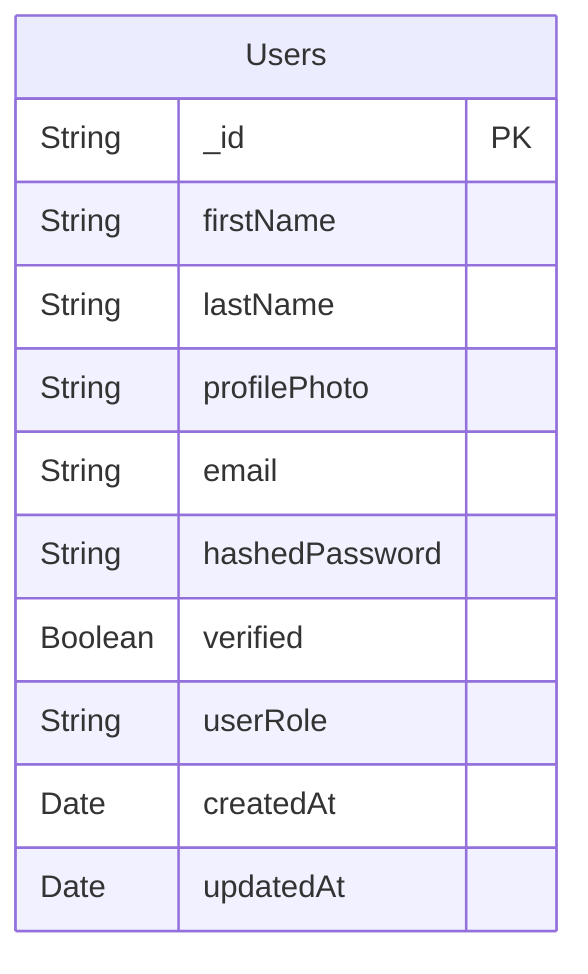
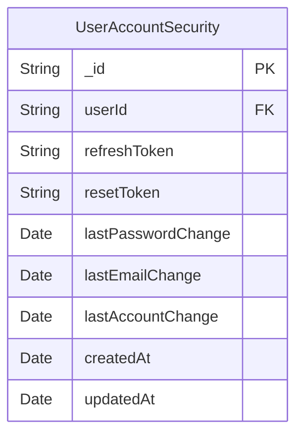
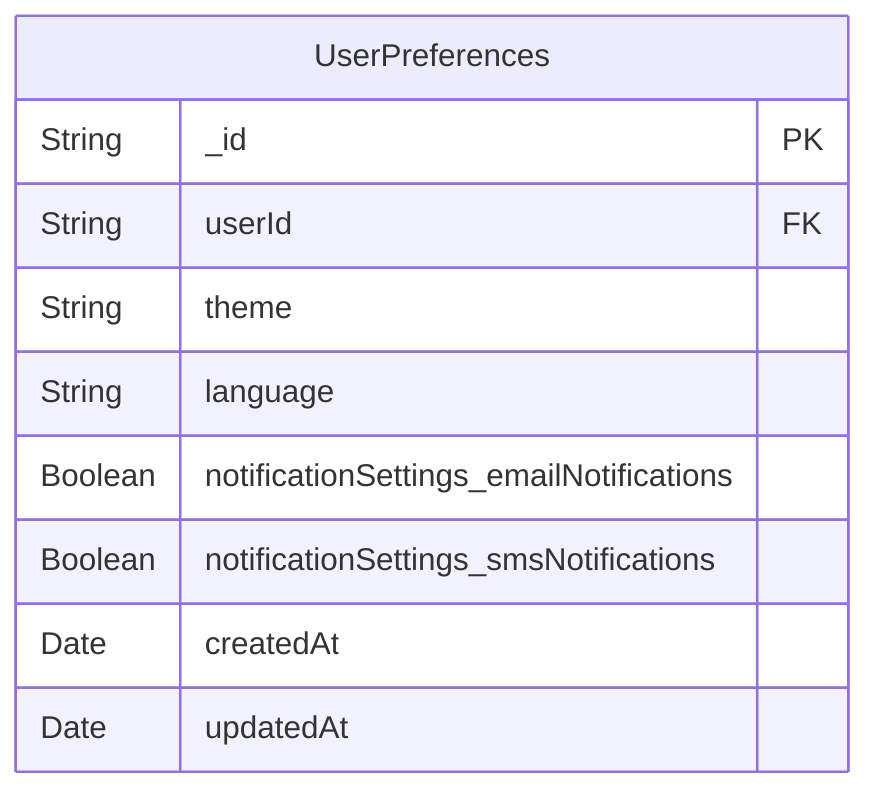
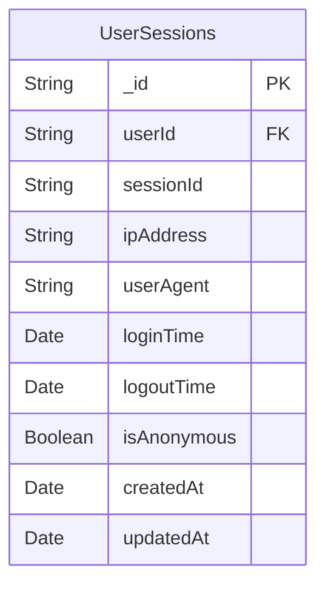
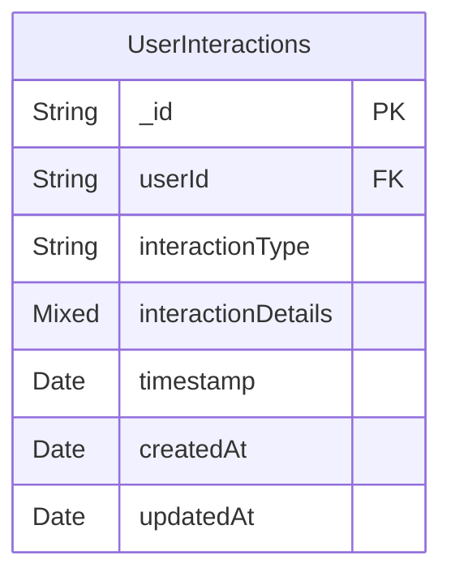
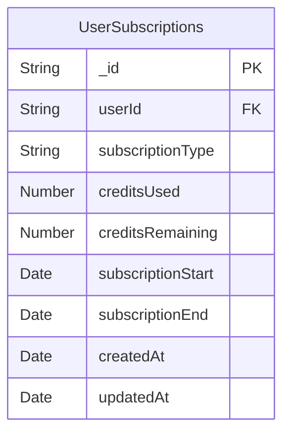
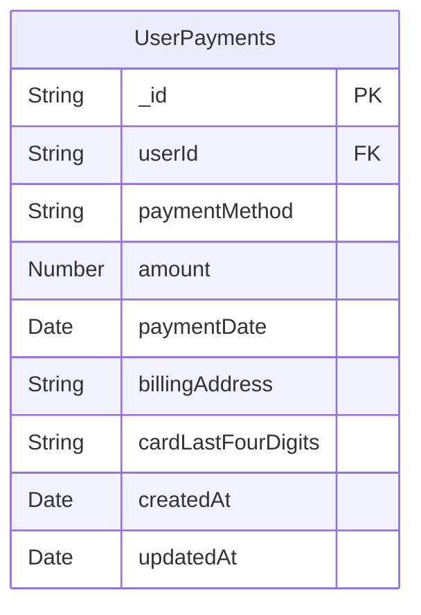

### Users ER Diagram









```mermaid
erDiagram
    UserSecurityAnswers {
        String _id PK
        String userId FK
        Number questionId
        String answerHash
        Date createdAt
        Date updatedAt
    }
````

```mermaid
erDiagram
    UserSecurityQuestions {
        String _id PK
        String userId FK
        Number questionId
        String answerHash
        Date createdAt
        Date updatedAt
    }
```







```plaintext

    %% Relations
    UserAccountSecurity ||--|| Users : "belongs to"
    UserPreferences ||--|| Users : "belongs to"
    UserSessions ||--|| Users : "belongs to"
    UserSecurityAnswers ||--|| Users : "belongs to"
    UserSecurityQuestions ||--|| Users : "belongs to"
    UserInteractions ||--|| Users : "belongs to"
    UserSubscriptions ||--|| Users : "belongs to"
    UserPayments ||--|| Users : "belongs to"
```
