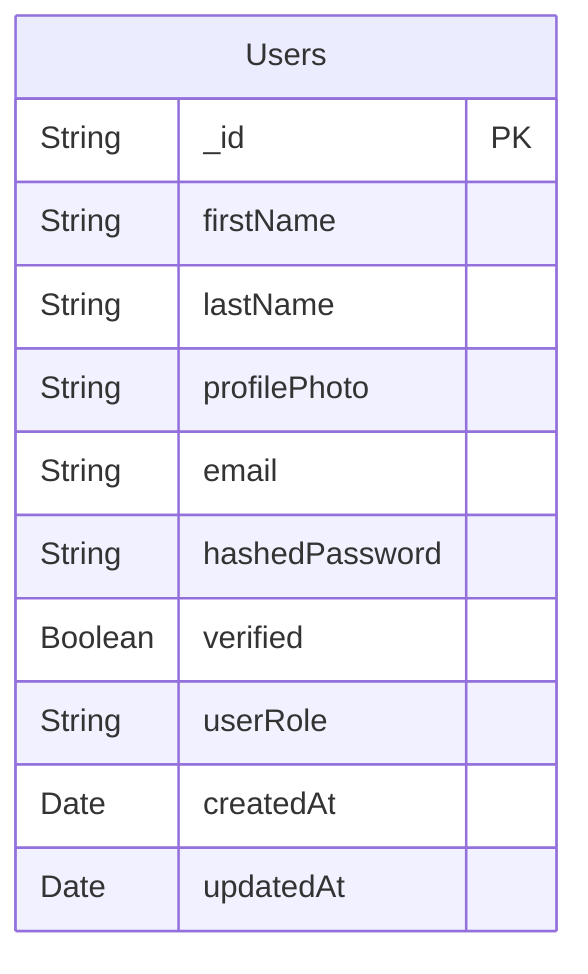
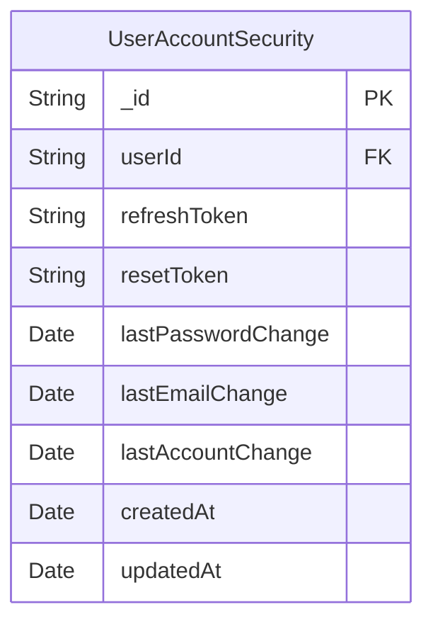
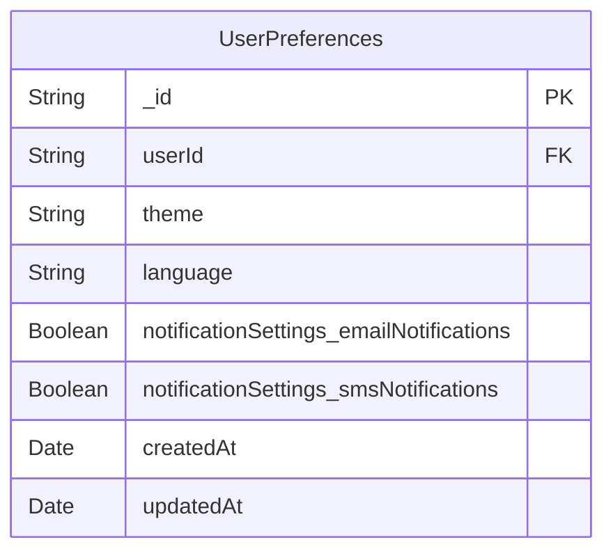
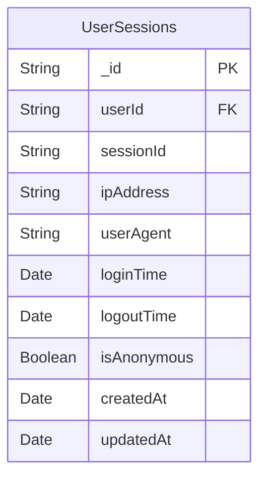
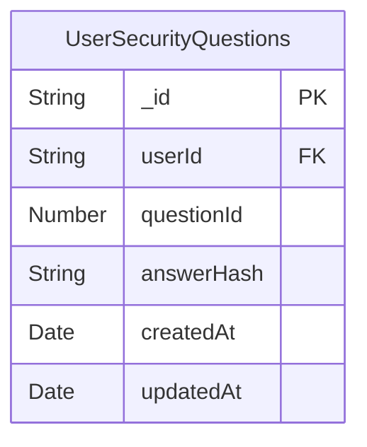
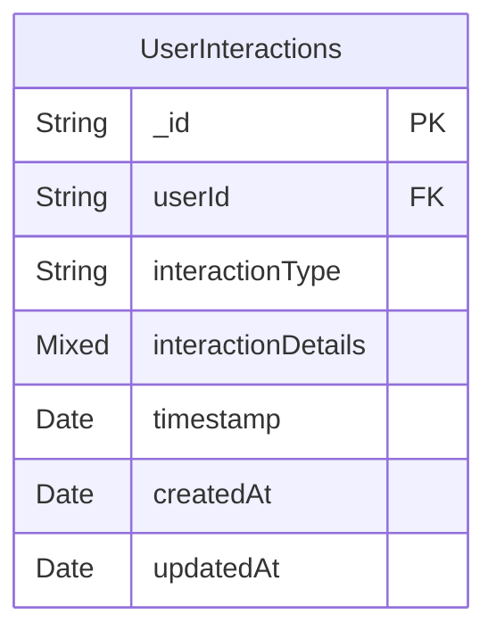
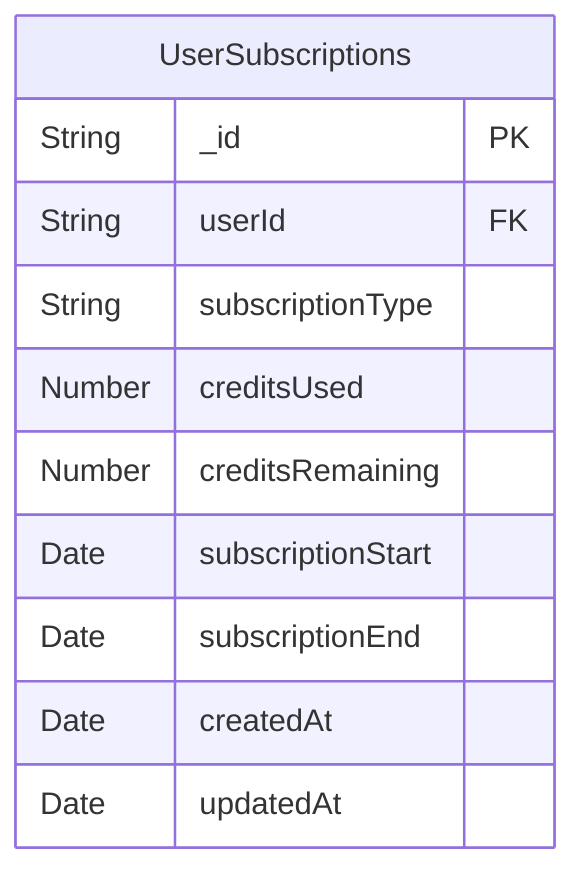
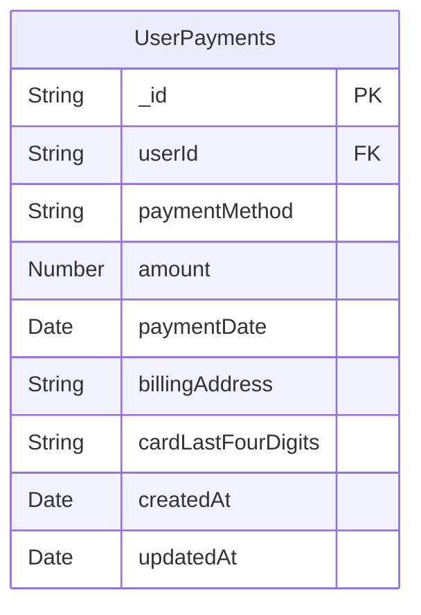

# Bulletproof SaaS Boilerplate

#### Table of Contents

<!-- [Toc] -->

## Overview

The **Bulletproof SaaS Boilerplate** is a fully scalable, production-grade foundation for building SaaS applications. It follows best practices, enforces strong security, and integrates essential third-party services to accelerate development and deployment.

## Tech Stack

                             

## Database Use Cases

🔹 Use PostgreSQL for:
✅ User Accounts – Emails, passwords (hashed), usernames
✅ Authentication & Authorization – Roles, permissions
✅ Subscriptions & Payments – Stripe/PayPal integration
✅ Orders & Transactions – E-commerce, invoices
✅ Relationships between data – Users & orders, followers, etc.
✅ Reports & Analytics – If data is structured and relational

🔹 Use MongoDB for:
✅ User Activity Logs – Tracking user logins, errors, analytics
✅ Audit Logs – Storing system events (e.g., password changes)
✅ CMS / Blog Content – Storing articles, comments, etc.
✅ Product Catalog – E-commerce product listings
✅ Notifications / Messages – Storing chat messages, in-app notifications
✅ IoT / Sensor Data – When real-time, unstructured data is needed

🔹 Use Redis for:
✅ Session Management – Store user sessions, login tokens
✅ Caching – Cache frequently accessed API responses
✅ Rate Limiting – Prevent abuse by limiting API requests
✅ Leaderboard / Ranking Systems – Store real-time game scores
✅ Background Jobs / Queues – Use with BullMQ to manage tasks

## `views` structure

```plaintext
views/
├── auth/
│   ├── Login.tsx
│   ├── Signup.tsx
│   ├── ForgotPassword.tsx
│   ├── AuthLayout.tsx       # Optional layout for auth pages
│   ├── authRoutes.tsx       # Routes for authentication
```

## Hierarchical Config

Use hierarchical config to organize environment variables by different environments

```javascript
const config = {
 environment: process.env.NODE_ENV,
 port: process.env.PORT,
};

// 👎 The object name already holds the context
const user = {
 userName: "...",
 userEmail: "...",
 userAddress: "...",
};

// 👍 Remove the unnecessary prefix
const user = {
 name: "...",
 email: "...",
 address: "...",
};
```

## Performance Notes:

### Summary of Speed Ratings

| Response Time | Rating                    | Notes                                                        |
| ------------- | ------------------------- | ------------------------------------------------------------ |
| **Sub-10ms**  | 🚀 **Excellent**          | Unusually fast, likely serving cached content or simple HTML |
| **10-50ms**   | 🔥 **Very Good**          | Well-optimized SSR with efficient rendering                  |
| **50-200ms**  | ✅ **Good**               | Normal range for SSR, including API/database calls           |
| **200-500ms** | ⚠️ **Needs Optimization** | Potential slow middleware, DB queries, or API bottlenecks    |
| **500ms+**    | ❌ **Bad**                | Poor performance; needs major fixes                          |

### Optimized Image Loading

```html
<picture>
 <source
  type="image/webp"
  srcset="
/image.webp?width=100 100w
/image.webp?width=200 200w
/image.webp?width=400 400w
/image.webp?width=800 800w
"
 />
 
</picture>
```

## Example Request Log:

```json
{
 "level": "info",
 "message": "Request Log",
 "method": "GET",
 "url": "http://localhost:3000/users?id=123&name=JohnDoe",
 "headers": {
  "host": "localhost:3000",
  "connection": "keep-alive",
  "user-agent": "Mozilla/5.0 (Windows NT 10.0; Win64; x64) AppleWebKit/537.36 (KHTML, like Gecko) Chrome/92.0.4515.159 Safari/537.36",
  "accept": "text/html,application/xhtml+xml,application/xml;q=0.9,image/avif,image/webp,image/apng,*/*;q=0.8",
  "accept-encoding": "gzip, deflate, br",
  "accept-language": "en-US,en;q=0.9",
  "cookie": "sessionId=abc123; userId=456"
 },
 "query": {
  "id": "123",
  "name": "JohnDoe"
 },
 "body": {},
 "cookies": {
  "sessionId": "abc123",
  "userId": "456"
 },
 "ip": "::1",
 "protocol": "http",
 "hostname": "localhost",
 "originalUrl": "/users?id=123&name=JohnDoe",
 "params": {},
 "secure": false,
 "subdomains": [],
 "userAgent": "Mozilla/5.0 (Windows NT 10.0; Win64; x64) AppleWebKit/537.36 (KHTML, like Gecko) Chrome/92.0.4515.159 Safari/537.36",
 "timestamp": "2024-09-03T12:34:56.789Z"
}
```

## Explanation of the Logged Object:

- level: The log level, which is “info” in this case.
- message: A label for the log entry, which we’ve set to “Request Log”.
- method: The HTTP method used for the request (e.g., “GET”).
- url: The full URL of the request, including the protocol, host, and path with query parameters.
- headers: An object containing all the HTTP headers sent with the request.
- query: The query parameters parsed from the URL.
- body: The parsed request body (empty in this example since it’s a GET request).
- cookies: An object representing the cookies sent with the request.
- ip: The IP address of the client making the request.
- protocol: The protocol used (e.g., “http”).
- hostname: The hostname of the server handling the request.
- originalUrl: The original request URL as received by the server.
- params: Route parameters (empty in this example since there are no route parameters).
- secure: A boolean indicating whether the request was made over HTTPS.
- subdomains: An array of subdomains in the request (empty in this example).
- userAgent: The User-Agent string from the request headers.
- timestamp: The timestamp when the log entry was created.

### 1. Session Data

- If your application uses session management (e.g., with `express-session`), you may want to log session-related information such as the session ID or any session variables.

```js
sessionId: req.sessionID,
sessionData: req.session,
```

### 2. Custom Headers

- If your application uses custom headers for specific purposes (e.g., `X-Request-ID`, `X-Auth-Token`), it’s a good idea to log these as well.

```js
   customHeaders: {
     'X-Request-ID': req.get('X-Request-ID'),
     'X-Auth-Token': req.get('X-Auth-Token'),
     // Add other custom headers as needed
   },
```

### 3. Cache-Related Headers

- If caching is important in your application, you might want to log cache-related headers like `Cache-Control`, `If-None-Match`, or `If-Modified-Since`.

```js
   cacheHeaders: {
     'Cache-Control': req.get('Cache-Control'),
     'If-None-Match': req.get('If-None-Match'),
     'If-Modified-Since': req.get('If-Modified-Since'),
   },
```

### 4. Authorization and Authentication

- If your application uses authorization or authentication mechanisms, logging related headers such as `Authorization` or `Cookie` might be useful. Be cautious about logging sensitive information like tokens or credentials.

authorization: req.get('Authorization'), // Be careful with sensitive info

You might also want to strip out sensitive parts of the authorization header, like:

authorization: req.get('Authorization') ? 'Bearer [REDACTED]' : null,

### 5. Referrer and Origin

- Logging the `Referer` (or `Referrer`) and `Origin` headers can be useful for understanding where the request is coming from.

```js
   referrer: req.get('Referer'),
   origin: req.get('Origin'),
```

### 6. User-Agent Details

- While you’re already logging the `User-Agent` string, you might want to parse it for more detailed analytics (e.g., browser, operating system). This can be done using libraries like `useragent` or `ua-parser-js`.

```js
   userAgentDetails: {
     browser: parsedUserAgent.browser,
     os: parsedUserAgent.os,
     device: parsedUserAgent.device,
   },
```

### 7. Geo-Location Data

- If your application captures geo-location data (e.g., via IP lookup), logging the user’s approximate location (city, region, country) might be useful.

```js
   geoLocation: {
     country: 'US',
     region: 'CA',
     city: 'San Francisco',
   },
```

This would typically require an additional service or middleware to provide the geo-location data based on the IP address.

### 8. Request Timing

- You might want to log how long it took to process the request. This can be done by capturing the start time at the beginning of the request and calculating the duration after the response is sent.

```js
const startTime = process.hrtime();

app.use((req, res, next) => {
 res.on("finish", () => {
  const diff = process.hrtime(startTime);
  const duration = diff[0] * 1e3 + diff[1] * 1e-6; // in milliseconds
  logger.info("Request Duration", { duration: `${duration.toFixed(3)} ms` });
 });
 next();
});
```

### 9. Response Details

- Although Morgan is handling response logging, you might want to ensure specific response details like status code, content type, and response size are also logged.

```js
responseStatus: res.statusCode,
responseContentType: res.get('Content-Type'),
responseSize: res.get('Content-Length'),
```

### 10. Custom Application Context

- Depending on your application, you might have custom context or metadata that you want to log, such as a user ID (if the user is authenticated), request ID (if you are tracking requests across microservices), or other application-specific data.

```js
userId: req.user ? req.user.id : null,
requestId: req.get('X-Request-ID'),
```

### 11. Error Information

- If an error occurs during the request, logging details about the error can be very helpful for debugging. This can include the error message, stack trace, and any relevant request data.

```js
app.use((err, req, res, next) => {
 logger.error("Request Error", {
  errorMessage: err.message,
  errorStack: err.stack,
  method: req.method,
  url: fullUrl,
  body: req.body,
  headers: req.headers,
  ip: req.ip,
 });
 next(err);
});
```

### Example with Additional Data:

```json
// Example with Additional Data:
{
 "level": "info",
 "message": "Request Log",
 "method": "GET",
 "url": "http://localhost:3000/users?id=123&name=JohnDoe",
 "headers": {
  "host": "localhost:3000",
  "connection": "keep-alive",
  "user-agent": "Mozilla/5.0 (Windows NT 10.0; Win64; x64) AppleWebKit/537.36 (KHTML, like Gecko) Chrome/92.0.4515.159 Safari/537.36",
  "accept": "text/html,application/xhtml+xml,application/xml;q=0.9,image/avif,image/webp,image/apng,*/*;q=0.8",
  "accept-encoding": "gzip, deflate, br",
  "accept-language": "en-US,en;q=0.9",
  "cookie": "sessionId=abc123; userId=456"
 },
 "query": {
  "id": "123",
  "name": "JohnDoe"
 },
 "body": {},
 "cookies": {
  "sessionId": "abc123",
  "userId": "456"
 },
 "ip": "::1",
 "protocol": "http",
 "hostname": "localhost",
 "originalUrl": "/users?id=123&name=JohnDoe",
 "params": {},
 "secure": false,
 "subdomains": [],
 "userAgent": "Mozilla/5.0 (Windows NT 10.0; Win64; x64) AppleWebKit/537.36 (KHTML, like Gecko) Chrome/92.0.4515.159 Safari/537.36",
 "customHeaders": {
  "X-Request-ID": "abc123456",
  "X-Auth-Token": "Bearer [REDACTED]"
 },
 "cacheHeaders": {
  "Cache-Control": "no-cache",
  "If-None-Match": "W/\"123abc\"",
  "If-Modified-Since": "Mon, 05 Jul 2024 07:28:00 GMT"
 },
 "referrer": "http://example.com",
 "origin": "http://example.com",
 "sessionId": "s12345",
 "sessionData": {
  "user": {
   "id": "u123",
   "name": "John Doe"
  }
 },
 "userAgentDetails": {
  "browser": "Chrome",
  "os": "Windows 10",
  "device": "Desktop"
 },
 "geoLocation": {
  "country": "US",
  "region": "CA",
  "city": "San Francisco"
 },
 "timestamp": "2024-09-03T12:34:56.789Z"
}
```

### Example Admin Responses

returns the number of users

`GET /admin/users/total` returns the number of users

```javascript
{
 result: {
  99278;
 }
}
```

`GET /admin/users/all` returns a list of all users and their details
Query parameters:

- page: The page number to retrieve (default is 1).
- per_page: The number of items per page (default is 10).
- sort_by: The field to sort the products by (default is 'id').- sort_order: The sort order ('asc' for ascending, 'desc' for descending, default is 'asc').
- is_active: Filter by active or inactive users (optional).

```javascript
{
  results: [],
  pagination: {
    count: 1,
    page: 0,
    pages: 0,
    per_page: 0,
    next: "http://localhost:3000/api/v1/admin/users/details?offset=10&limit=10",
    prev: "http://localhost:3000/api/v1/admin/users/details?offset=10&limit=10"
  }
}
```

`GET /admin/:userId/details` returns detailed information for a specific user

```javascript
{
  results: [],
  pagination: {
    count: 1,
    page: 0,
    pages: 0,
    per_page: 0,
    next: "http://localhost:3000/api/v1/admin/users/details?offset=10&limit=10",
    prev: "http://localhost:3000/api/v1/admin/users/details?offset=10&limit=10"
  }
}
```

## Financial Tracking & Analytics:

- Create financials endpoint for admins and product owners to read and analyze financial data.
- Annual summary
- Quarterly earnings
- Monthly earnings
- Weekly earnings
- Financial KPIs
- Customer Acquisition Cost
- Monthly Recurring Revenue
- Average Revenue Per User
- Gross Margin
- Monthly Unique Visitors
- Customer Conversion Rate
- Customer Retention Rate
- Customer Lifetime Value
- Recurring Monthly Revenue
- Churn Rate
- Product Sign Up Rate
- Product Referral Rate Per Influencer
- Support Ticket Creation Rate
- Customer Feedback Rate

## API Design Rules

##### Rule: Forward slash separator (/) must be used to indicate a hierarchical relationship

See this example: http://api.canvas.restapi.org/shapes/polygons/quadrilaterals/squares

##### Rule: A trailing forward slash (/) should not be included in URIs

It may cause confusion and there is no semantic value to it. a REST API must generate and communicate clean URIs and should be intolerant of any client’s attempts to identify a resource imprecisely.

##### Rule: Hyphens (-) should be used to improve the readability of URIs. Anywhere you would use a space or hyphen in English, you should use a hyphen in a URI.

See this example: /my-first-blog-post

##### Rule: Underscores (\_) should not be used in URIs.

Depending on the application’s font, the underscore (\_) character can either get partially obscured or completely hidden by this underlining.

##### Rule: User Lowercase Letters

Lowercase Letters should be preferred in URI paths for readability.

##### Rule: File extensions should not be included in URIs.

It makes the URI paths cleaner.

##### Rule: Consistent subdomain names should be used for your APIs

See this example: api.example.com

##### Rule: Consistent subdomain names should be used for your client developers

This will help on-board new clients with documentation, forums, and self-service provisioning of secure API access keys.
See this example: dev.example.com

##### Rule: A singular noun should be used for document names

See this example: http://api.soccer.restapi.org/leagues/seattle/teams/trebuchet/players/claudio

##### Rule: A plural noun should be used for collection names

Because collections contain more than one record or piece of data.

##### Rule: A plural noun should be used for store names

See this example: http://api.music.restapi.org/artists/mikemassedotcom/playlists

##### Rule: A verb or verb phrase should be used for controller names

See this example: /register

##### Rule: Variable path segments may be substituted with identity-based values.

The URI Template syntax allows designers to clearly name both the static and variable segments. Each substitution may use a numeric or alphanumeric identifier.
See this example: http://api.soccer.restapi.org/leagues/{leagueId}/teams/{teamId}/players/{playerId}

##### Rule: CRUD function names should not be used in URIs

##### Rule: The query component of a URI may be used to filter collections or stores

##### Rule: The query component of a URI should be used to paginate collection or store results

##### Rule: GET must be used to retrieve a representation of a resource

##### Rule: HEAD should be used to retrieve response headers.

HEAD returns the same response as GET, except that the API returns an empty body. Clients can use this method to check whether a resource exists or to read its metadata.

##### Rule: PUT must be used to both insert and update a stored resource

##### Rule: PUT must be used to update mutable resources

##### Rule: POST must be used to create a new resource in a collection

##### Rule: POST must be used to execute controllers

##### Rule: DELETE must be used to remove a resource from its parent

If an API wishes to provide a “soft” delete or some other state-changing interaction, it should employ a special controller resource and direct its clients to use POST instead of DELETE to interact.

##### Rule: 202 (“Accepted”) must be used to indicate successful start of an asynchronous action

A 202 response is typically used for actions that take a long while to process.
Controller resources may send 202 responses, but other resource types should not.
For example, the GitHub workflow API to trigger a workflow.

##### Rule: Content-Type must be used

Clients and servers rely on this header’s value to tell them how to process the sequence of bytes in a message’s body.

##### Rule: Content-Length should be used

The Content-Length header gives the size of the entity-body in bytes. In responses, this header is important for two reasons. First, a client can know whether it has read the correct number of bytes from the connection. Second, a client can make a HEAD request to find out how large the entity-body is, without downloading it.

##### Rule: Last-Modified should be used in responses

The Last-Modified header applies to response messages only. The value of this response header is a timestamp that indicates the last time that something happened to alter the representational state of the resource. Clients and cache intermediaries may rely on this header to determine the freshness of their local copies of a resource’s state representation. This header should always be supplied in response to GET requests.

##### Rule: ETag should be used in responses

##### Rule: Location must be used to specify the URI of a newly created resource

Research when to use this header.

##### Rule: Cache-Control, Expires, and Date response headers should be used to encourage caching

##### Rule: Cache-Control, Expires, and Pragma response headers may be used to discourage caching

Pragma header for legacy http 1.0

##### Rule: Caching should be encouraged

Using a small value of max-age as opposed to adding no-cache directive helps clients fetch cached copies for at least a short while without significantly impacting freshness.

##### Rule: Expiration caching headers should be used with 200 (“OK”) responses

##### Rule: Expiration caching headers may optionally be used with 3xx and 4xx responses

Known as negative caching, this helps reduce the amount of redirecting and error-triggering load on a REST API.

##### Rule: Authentication, Session, metadata, and format directives should be sent in the headers

E.g. API Keys, ClientIDs, UserIDs, JSON directive or XML directive, SessionIDs

##### Rule: Custom HTTP headers must not be used to change the behavior of HTTP methods

##### Rule: custom http headers should only be used for authentication, authorization, security, rate limiting, client preferences, feature flags, A/B testing and experimentation groups.

##### Rule: custom HTTP headers should begin with the “X-“ prefix.

##### Rule: use custom http headers only when necessary. Avoid overusing.

##### Rule: Content-Type header should always be provided

This way client knows what media type to expect.

Section: Resource Representation Design

##### Rule: JSON should be supported for resource representation

##### Rule: JSON must be well-formed

##### Rule: XML and other formats may optionally be used for resource representation through media type negotiation

##### Rule: A consistent form should be used to represent errors

E.g. {
"id" : Text,  
 "description" : Text  
}

The unique ID/code of the error type. Clients should use this ID to understand what sort of error has occurred and act/message accordingly. This can be an error code similar to Mongoose error codes thrown when there is a database transaction error. Followed by a plain text description of the error. Ideally, there should be a simple error message and a verbose error message describing the error in detail if client is displaying error to users. There should also be a link to the documentation directing users to the error code.

##### Rule: A consistent form should be used to represent error responses

Client related:

##### Rule: New URIs should be used to introduce new concepts

A resource is a semantic model, like a thought about a thing.

##### Rule: Schemas should be used to manage representational form versions

##### Rule: Entity tags should be used to manage representational state versions

##### Rule: OAuth may be used to protect resources

##### Rule: API management solutions may be used to protect resources

If in house API management solution becomes overly complicated, opt-in for a 3rd-party solution.

##### Rule: The query component of a URI should be used to support partial responses

E.g. Excluding certain fields to get back a smaller response or to leave out unnecessary data.
E.g. Using “fields” query parameter for selected fields to be included in the response.

##### Rule: CORS preflight should be enabled

CORS relies on a mechanism by which browsers make a "preflight" request to the server hosting the cross-origin resource, in order to check that the server will permit the actual request.

## Guide To Testing The Backend

If short on time, prefer integration tests over unit tests because it covers logical workflows ands business logic

Unit test the business logic which is under your control.

Follow the Arrange-Act-Assert pattern in testing.

```javascript
describe("User Service", () => {
 it("Should create a user given correct data", async () => {
  // 1. Arrange - prepare the data, create any objects you need
  const mockUser = {
   // ...
  };
  const userService = createUserService(mockLogger, mockQueryBuilder);

  // 2. Act - execute the logic that you're testing
  const result = userService.create(mockUser);

  // 3. Assert - validate the expected result
  expect(mockLogger).toHaveBeenCalled();
  expect(mockQueryBuilder).toHaveBeenCalled();
  expect(result).toEqual(/** ... */);
 });
});
```

- Use Artillery for stress testing
- Create test users to test permissions
- Create test users to test authentication
- Create test users to test api resources
- Give test user names and personalities

## Users ER Diagram


















```plaintext
    %% Relations
    UserAccountSecurity ||--|| Users : "belongs to"
    UserPreferences ||--|| Users : "belongs to"
    UserSessions ||--|| Users : "belongs to"
    UserSecurityAnswers ||--|| Users : "belongs to"
    UserSecurityQuestions ||--|| Users : "belongs to"
    UserInteractions ||--|| Users : "belongs to"
    UserSubscriptions ||--|| Users : "belongs to"
    UserPayments ||--|| Users : "belongs to"
```

## Demo and POC Best Practices

1. Use JSON with readFileStream to mock RestAPI calls.
2. Build on the product backend and business functions until solidified.
3. Only move from hard coded backend when mock exemplifies product very closely.

## Pressing Questions

- What are the helmet.js configs for public facing API's?
- What are the helmet.js configs for internal API's?
- What is the best way to implement role-based security (aka RBAC)?
- Should I create a separate table/ collection for roles/ permissions?
- What are the different types of user roles my app needs?
- What is the recommended System Inactivity Timeout before system logs user out?
- What is the difference between a user role and a security profile?
- How much user login history should be kept?
- What integration can we use for SAML (Security Assertion Markup Language)?
- What integration can we use for SSO (Single Sign On)?
- How to implement OAuth 2.0?
- How to integrate Auth0 by Okta?
- How to integrate GitHub sign up / login ?
- How to integrate Apple sign up / login ?
- How to integrate Google sign up / login ?
- How to integrate Facebook sign up / login ?
- How to implement API Key authorization?

## Developer API's and SDK's:

---

- Provide developers a client side SDK for your API. These code packages are designed to help developers get up and running quickly with their projects by simplifying some of the transactional layers and setup of an application.

- Ido Green, developer advocate at Google, on what makes an API good: “The API should enable developers to do one thing really well. It’s not as easy as it sounds, and you want to be clear on what the API is not going to do as well.”

- Make your developer APIs fast and easy to get started using.

- No matter how carefully we design and build our core API, developers continue to create products we’d never expect. We give them the freedom to build what they like. Designing an API is much like designing a transportation network. Rather than prescribing an end state or destination, a good API expands the very notion of what’s possible for developers. Romain Huet, head of developer relations at Stripe

- In some cases, you can supplement the ease of use by providing interactive documentation online, where developers have a sandbox to test out your API. Oftentimes, developers can use these interfaces to test code and preview results without having to implement authentication. A great example of sandbox-based documentation is Stripe’s documentation.


- APIs need to be consistent. That could include anything from data access patterns to error handling to naming. The reason consistency is important is that it reduces the cognitive load on developers who are trying to figure out your API. With less consistency, different developers will need to reimplement the same logic over and over again.

- Another best practice for designing APIs is making troubleshooting easy for developers. This can be done through returning meaningful errors as well as by building tooling. Providing these errors with details leads to a better developer experience. Error codes that are machine-readable strings allow developers to programmatically handle errors in their code bases.

---

When deprecating an API or an endpoint, add release notes to indicate deprecation.

Documentations should always provide sample code.

The API and the documentation both should be easy to understand.

The API should have a good SDK in multiple languages.

## The API should be easy to test.

Building a successful API is an art, comprising business analysis, technology architecture, software development, partnership, content writing, developer relations, support, and marketing.

Validate your API with real users; ask your developers for constant feedback; be transparent with your changes, policies, rate limits, and updates; and be a member of your own developer community.

After you unlock the product-market fit for your API and foster a developer ecosystem around it, you will experience magic—developers will use your API to innovate, empower amazing new solutions, and build things you didn’t think were possible.

There is no better feeling than building something that millions of people use every day to make their lives better. Trust us, we have done that, and you can, too.

## To ensure scalability as your application grows

Subdivide Large Resources: As a resource like users expands, break it down into smaller submodules or domains, such as profile, settings, and subscription. Each subdomain should have its own folders for models, controllers, and routes, making the resource more manageable and organized.

Consider Domain-Driven Design (DDD): As complexity increases, shift your organization from resource-based to domain-based. For example, instead of having all user-related logic in one place, you could organize your code around business domains, grouping models, controllers, and routes according to their specific domain logic, like UserProfile, UserSettings, and UserSubscription. This approach helps maintain clarity and modularity in a large application.

### Difference between /utils and /lib

The difference between a /utils and a /lib folder generally comes down to the type of functionality and the scope of the code they contain. While there’s some overlap and the exact distinction can vary depending on the project or team, here’s a general breakdown:

##### /utils Folder:

Purpose: The /utils (short for "utilities") folder typically contains small, reusable helper functions or utility modules. These functions are usually stateless and perform generic tasks like data formatting, string manipulation, date calculations, logging, etc.

Scope: Utilities are often project-specific and are designed to be used within the context of a single project. They are usually lightweight and focused on specific tasks that don’t necessarily belong to any single module or component.

Examples:

- Functions for formatting dates or numbers.
- String manipulation utilities.
- Basic validation functions.
- Commonly used constants or configurations.

```javascript
function formatDate(date) {
 return new Intl.DateTimeFormat("en-US").format(date);
}

function generateRandomString(length) {
 return Math.random()
  .toString(36)
  .substring(2, length + 2);
}
```

##### /lib Folder:

Purpose: The /lib (short for "library") folder typically contains larger, more complex modules or libraries. These might be collections of functions, classes, or third-party integrations that provide more substantial functionality. The code in /lib might be reusable across multiple projects or represent a self-contained library within your application.

Scope: Code in /lib is often more general-purpose and could potentially be extracted into its own package or module for reuse across different projects. These libraries might include custom implementations of significant functionality like API clients, database wrappers, or even more substantial utilities that don’t fit the narrow, helper-focused nature of /utils.

##### Summary of Differences:

- Size and Complexity:
  - /utils functions are generally small, simple, and focused on specific tasks.
  - /lib modules are often larger and more complex, potentially encompassing a broader range of functionality.
- Scope:
  - /utils is typically project-specific, providing small utilities that don’t warrant their own library.
  - /lib might contain more substantial code that could be reused across different projects or packaged as a standalone module.
- Use Case:
  - Use /utils for small, helper functions that are specific to the project.
  - Use /lib for more complex, potentially reusable libraries or modules that encapsulate significant functionality.

### 7. The /config directory

You might also have a default.js file with default settings that apply across all environments, which can be overridden by environment-specific files.

You may also have a .env file for storing environment variables. These are typically loaded using a package like dotenv.

Configuration settings for connecting to databases, including connection strings, credentials, and other related options.
